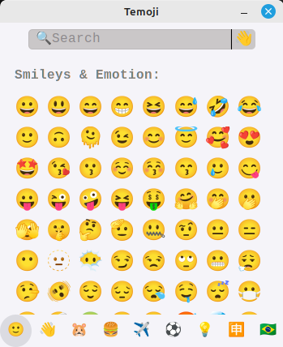

  

  <h1 align="center">Temoji</h1>

### Features:
Current it's basically all the features a normal Emoji Picker
would have...
- [x] Get emojis
- [x] Filter by:
  - [x] Groups
  - [x] Skin Tones
  - [x] Keys

### Planned changes & features:
- [ ] Separate the emoji groups by links (there will only be one page containing all the emojis) instead of filtering them every time a group is clicked
- [ ] Improve the way you get skin toned emojis (a popup, containing the coloured emojis instead of pre-selecting on the seach bar, will be shown)
- [ ] Custom settings
  - [ ] Shortcuts
  - [ ] Preferred skin tone
  - [ ] System tray implementation
    - [ ] Custom right-click behavior (the usual...)
    - [ ] App stay opens in the background
    - [ ] App opens when system is initiated
- [ ] Dark mode
- [ ] Pre-compiled binaries

### Showcase:

### Build it yourself:
Soon...